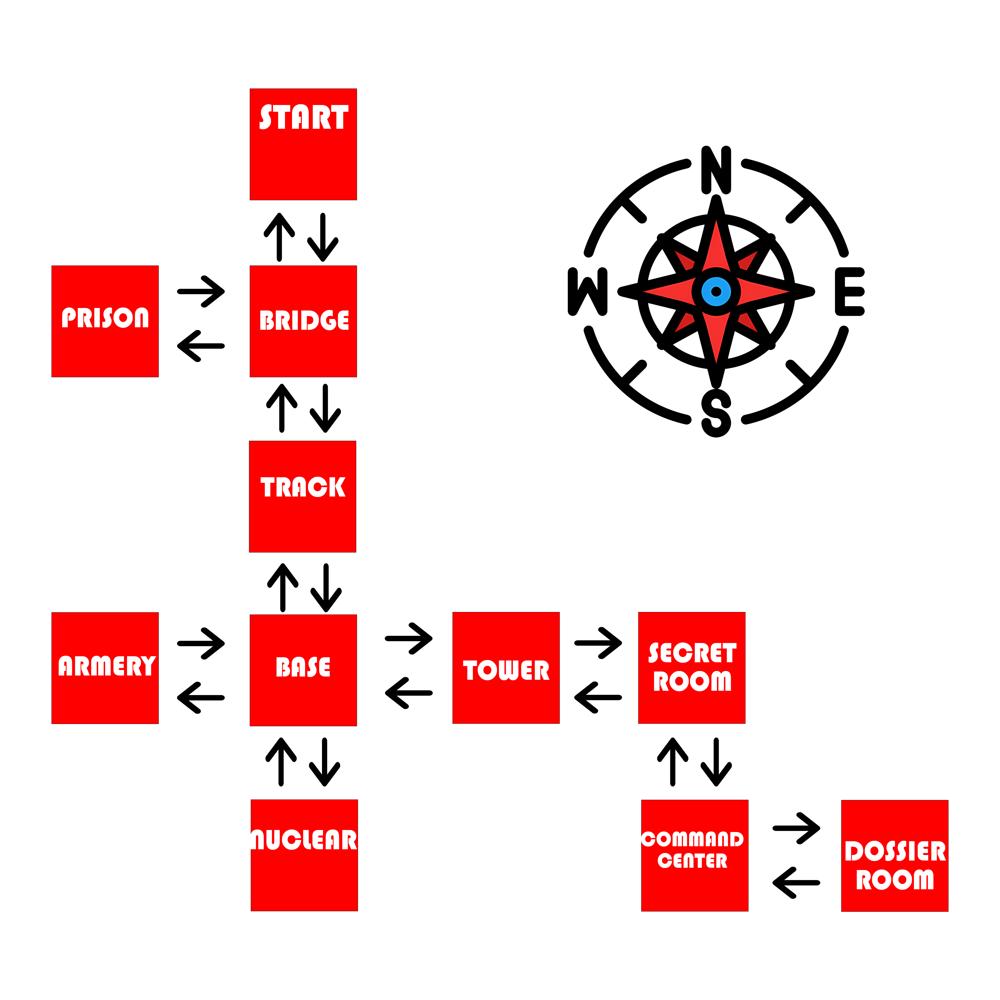
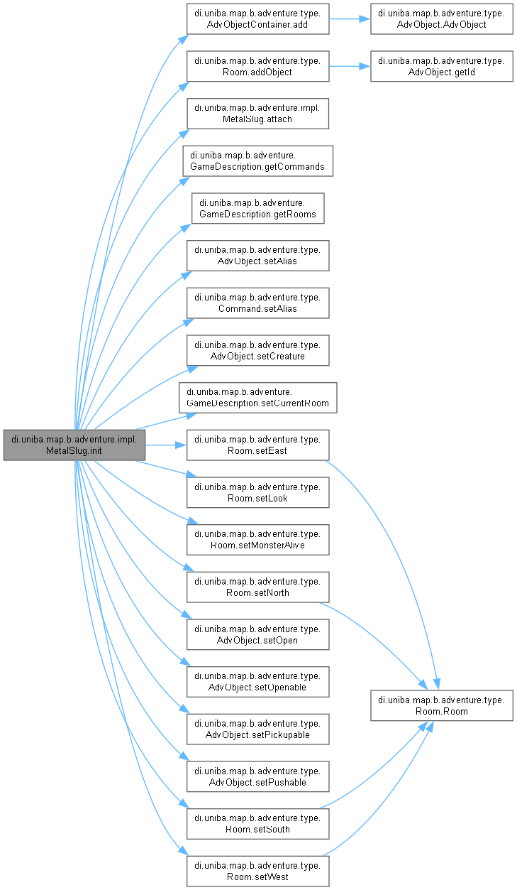

# Metal Slug : Fuga dalla base fantasma

**Progetto per l'esame di metodi avanzati di programmazione creato da Francesco Troiano**<br>
<br>
**Questo progetto è è stato creato prendedno spunto da uno dei miei giochi arcade favoriti degli anni 2000 ... Metal Slug**<br>
**Molti dettagli  del gioco originale sono stati  presi e riadatti in modo tale da poter essere coerente con l'avventura testuale**.
<br>


> ### 🟥 Per avviare correttamente il gioco, è necessario prima eseguire il programma `RESTClient` (presente all'interno della repository) e lasciarlo in esecuzione (runtime).  
> ### 🟥 Successivamente, è possibile avviare il gioco aprendo il progetto MetalSlug ed eseguendo la classe `Engine.java`.


<br>
## 📚 Introduzione

In questo progetto ho usato la trama di **Metal Slug** per creare una avventura testauele interattiva progettata per l'esame di "Metodi Avanzati di Programmazione". Questa applicazione è sviluppata interamente in Java e offre un'esperienza di gioco coinvolgente attraverso un'interfaccia grafica (GUI). 
I giocatori prendono il controllo di un soldato di guerra il quale dovrà riuscire a scappare da una base nemica utilizzando l'arma delle resistenza : il Metal Slug , un carro armato speciale in grado di portare in salvo il protagonista . Il programma include inoltre funzionalità di salvataggio e caricamento della partita, oltre a una classifica globale gestita tramite server. 

##  📚Descrizione del gioco

Dopo essere stato catturato dai nemici, Marco Rossi (il protagonista del gioco ) riesce a fuggire e si ritrova in una base nemica abbandonata. L’unica via di salvezza è un Metal Slug inerte, ma per attivarlo servono carburante e codici di accesso. Per recuperare tali oggetti bisognerà esplorare la mappa , affrontare un Cyborg, e risolvere enigmi così da poter riattivare il veicolo speciale e solo a quel punto fuggire dalla base nemica.<br>
Tutto ciò è spiegato all'inizio del gioco in modo da far comprendere al giocatore la trama dell'avventura .

##  📚Come si gioca 

Per poter muoversi all'interno della mappa il giocatore dovrà usare comandi come : NORD , SUD , EST , OVEST . 
Il giocatore facendo ciò potrà muoversi agilmente all'interno della mappa così da esplorare i vari luoghi . 
Tramite il comando "osserva" il giocatore potrà avere informazioni più dettaliate della stanza in cui si trova così da avere infromazioni ed evntualmente anche suggerimenti . <br>
Inoltre tramite i comandi "raccogli" , "apri" ,leggi  ... il giocatore potrò interagire direttamente con gli oggetti 

## 📃 Fasi del gioco 

- **Inizio Mappa**

*Descrizione*: Il giocatore è  riuscito a scppare dai nemici . Adesso si ritrova sperduto nel nulla . <br>
 Davanti a lui un ponte e dall'altra parte un metal slug (che potrà usare per tornare a casa solo una volta recuperati gli oggetti necessari )

 - **Dirigersi verso la prigione**

 *Descrizione* : Ad OVEST del ponte c'è una prigione con all'interno un alleato di guerra<br>
 *Azione* : `Apri` la prigione e `raccogli` la tanica di benzina così da alimentare il metal slug.<br>
 Attenzione : non basterà sola la benzina per accendere il carro armato !

 - **Dirigersi verso l'armeria**

*Descrizione* : Ad OVEST della base fantasma si trova una vecchia armeria . <br>
*Azione* : `Raccogli` l'arma ( Heavy Metal Machine) per uccidere il Cyborg collocato nella Centrale Operativa

- **Dirigersi verso Centrale Operativa**

*Descrizione* : A SUD della stanza segreta si trova il cuore della base , la centrale Operativa .<br>
Al suo interno un Robot nucleare pronto ad attacarti . Dovrai uscciderlo per poter andare avanti
*Azione* : `Uccidi` il Cyborg così da poter entrare nell'ultima stanza <br>


- **Dirigersi verso Sala Dossier**

*Descrizione* : Ad EST della centrale operativa si trova la sala dossier .<br>
*Azione* : `Raccogli` il file top secret e `leggi` i codici di avvio  da inserire nel metal slug.
*Attenzione* : per attivare Il Metal Slug non bastano i codice ma serve anche la benzina

- **Fase finale**

*Descrizione* : Una volta ottenuti tutti gli oggetti ` [tanica di benzina]`  e il codice `[codice di accesso : 1996]` , il personaggio potrà riattivare il veicolo cosi da poter tornare a casa.<br>
*Azione* : Ritorna ad inzio mappa cosi da `attivare` il metal slug  per poi `acedere` ai comandi ed inserire il codice<br>

**Seguendo questi passaggi e raccogliendo tutti gli oggetti il giocatore avrà terminato il gioco correttamente .**


## 🗺️  Mappa del gioco

  

Il giocatore potrà muoversi all'intenro del gioco segeundo questa mappa.<br>
Ci sarannno degli ostacoli (come : filo spinato e mine antiuomo) che  bloccheranno il percorso e sarà compito del giocatore trovare il percorso migliore.

## 🚀 Comandi Principali
Per interagire con il gioco, utilizza i seguenti comandi:
<br>
nord: Spostati a nord.<br>
sud: Spostati a sud.<br>
est: Spostati a est.<br>
ovest: Spostati a ovest.<br>
osserva: Osserva la stanza attuale per ottenere suggerimenti .<br>
prendi : Prendi un oggetto.<br>
apri : Apri una un oggetto, se possibile.<br>
ammazza : Ammazza qualsiasi Cyborg/robot esistente.<br>
inventario : Stampa tutti gli oggetti che il giocatore ha raccolto durante la partita.<br>
abbandona: Termina il gioco.<br>
attiva/accendi: Attiva il Metal Slug e i relativi  comandi.<br>
leggi: Legge i file.<br>

## 📘 Specifica Algebrica — Dizionario

Questa **specifica algebrica** definisce formalmente il comportamento di un **dizionario**, una struttura dati che associa **chiavi univoche** a **valori**. Viene modellata attraverso tre livelli:

- **Sintattico**: descrizione dei tipi e delle operazioni.
- **Semantico**: comportamento delle operazioni.
- **Di restrizione**: vincoli logici per garantire la coerenza.

---

# 🧩 Specifica Sintattica

Definisce **sorts** (tipi di dati astratti) e le **operazioni** disponibili.

### Sorts (Tipi)
- `Dizionario`: rappresenta l’intera struttura.
- `chiave`: tipo delle chiavi.
- `valore`: tipo dei valori.
- `Boolean`: tipo booleano (`true` / `false`).
- `Integer`: tipo intero.
- `List<T>`: lista di elementi di tipo `T`.

###  Operazioni

| Operazione | Firma | Descrizione |
|------------|-------|-------------|
| `newDizionario()` | → Dizionario | Crea un nuovo dizionario vuoto |
| `put(d, k, v)` | Dizionario × chiave × valore → Dizionario | Inserisce o aggiorna la coppia (k, v) |
| `get(d, k)` | Dizionario × chiave → valore | Restituisce il valore associato alla chiave `k` |
| `remove(d, k)` | Dizionario × chiave → Dizionario | Rimuove la chiave `k` dal dizionario |
| `isEmpty(d)` | Dizionario → Boolean | Verifica se il dizionario è vuoto |
| `containsKey(d, k)` | Dizionario × chiave → Boolean | Verifica se la chiave `k` è presente |
| `containsValue(d, v)` | Dizionario × valore → Boolean | Verifica se il valore `v` è presente |
| `size(d)` | Dizionario → Integer | Restituisce il numero di coppie chiave-valore |
| `keySet(d)` | Dizionario → List<chiave> | Restituisce la lista delle chiavi presenti |
| `values(d)` | Dizionario → List<valore> | Restituisce la lista dei valori presenti |
| `clear(d)` | Dizionario → Dizionario | Rimuove tutti gli elementi |

---

# 📐 Specifica Semantica

Esplicita il **significato logico e funzionale** delle operazioni.

###  Siano `d: Dizionario` ,  `k: chiave` ,  `v: valore` :


- isEmpty(newDizionario()) = true
- isEmpty(put(d, k, v)) = false
- get(put(d, k, v), k) = v
- get(d, k) = undefined` se containsKey(d, k) = false
- remove(d, k) = d se containsKey(d, k) = false
- containsKey(remove(d, k), k) = false
- containsKey(put(d, k, v), k) = true
- containsValue(d, v) = (∃k | get(d, k) = v)
- size(newDizionario()) = 0
- size(put(d, k, v)) = size(d) + 1 se containsKey(d, k) = false
- size(put(d, k, v)) = size(d) se containsKey(d, k) = true
- size(remove(d, k)) = size(d) - 1 se containsKey(d, k) = true
- size(remove(d, k)) = size(d) se containsKey(d, k) = false
- keySet(d) = { k } | containsKey(d, k)
- values(d) = [ get(d, k) | k ∈ keySet(d) ]
- isEmpty(clear(d)) = true

---

## 🔒 Specifica di Restrizione

Definisce **vincoli** da rispettare per garantire la **coerenza interna** del dizionario.


Per ogni `d: Dizionario`, `k: chiave`, `v: valore`, valgono:

- ∀k' ≠ k ⇒ get(put(d, k, v), k') = get(d, k')
- ∀k' ≠ k ⇒ get(remove(d, k), k') = get(d, k')
- keySet(d).contains(k) ⇔ containsKey(d, k)
- values(d).contains(v) ⇔ containsValue(d, v)
- ∀k ⇒ containsKey(clear(d), k) = false

---

Questa specifica fornisce una **base formale** utile per:
- Implementare un dizionario coerente ,verificare la correttezza tramite test o metodi formali , costruire una libreria generica di strutture dati.
<br>
<br>

# 🎮 Applicazione della Programmazione a Oggetti nello Sviluppo di Metal Slug

Nel progetto Metal Slug ho applicato i principi della programmazione orientata agli oggetti per modellare in modo modulare ed estensibile ogni componente del gioco. Ho creato classi per stanze, oggetti, comandi e personaggi, sfruttando ereditarietà e polimorfismo per gestire comportamenti diversi. Inoltre ho utilizzato il pattern Observer, per aggiornare dinamicamente lo stato del gioco in risposta alle azioni del giocatore,  con l’obiettivo di rendere il codice strutturato, riusabile ed estendibile.

####  Concetti Fondamentali Applicati

- **Classi come astrazioni di gioco:**  
  Ogni elemento del gioco (come stanze, oggetti, comandi, eventi) è stato modellato attraverso classi dedicate. Queste entità incapsulano attributi e comportamenti specifici, rendendo più semplice la gestione delle logiche di gioco.

- **Incapsulamento delle funzionalità:**  
  Le classi espongono solo ciò che è necessario tramite metodi pubblici, mantenendo nascosti i dettagli interni. Questo permette di proteggere lo stato dell’oggetto e garantire consistenza.

- **Ereditarietà per estendere comportamenti:**  
  Le classi specifiche derivano da classi più generiche. Ad esempio, `MetalSlug` eredita da `GameDescription`, potenziando la struttura con logiche di gioco dedicate senza riscrivere codice.

- **Polimorfismo attraverso interfacce:**  
  L’interazione tra osservatori (`GameObserver`) e soggetti (`GameObservable`) è stata gestita tramite interfacce, permettendo di sostituire o estendere facilmente i comportamenti reattivi del gioco.

#### Alcune delle classi aggiunte per il progetto che intgrano il concetto di polmorfismo 

- `KillObserver` :  
  Implementa la logica per eliminare nemici presenti in una stanza. Quando il giocatore esegue il comando "uccidi", l’osservatore verifica la presenza del mostro e ne aggiorna lo stato, modificando dinamicamente l’aspetto della stanza.

- `ReadObserver` :  
  Gestisce la lettura di oggetti come file o documenti. Quando il giocatore utilizza il comando "leggi", l’osservatore mostra il contenuto testuale dell’oggetto, arricchendo la narrazione e fornendo indizi utili.

####  Benefici dell’approccio OOP

- **Separazione delle responsabilità:**  
  Ogni classe è responsabile di un compito preciso, migliorando la leggibilità e semplificando le modifiche future.

- **Codice riusabile e adattabile:**  
  I componenti sono stati progettati per essere indipendenti e riutilizzabili in contesti diversi, come nuove avventure o modalità di gioco.

- **Facilità di manutenzione:**  
  Grazie a un design modulare, aggiungere una nuova stanza, comando o oggetto richiede modifiche minime, senza compromettere l’intero sistema.

- **Estendibilità naturale:**  
  L’introduzione di nuove funzionalità (es. interazioni avanzate, nemici, scenari dinamici) può essere fatta aggiungendo nuove classi o estendendo quelle esistenti.

---
# 💾 Utilizzo dei file – gestione salvataggio dati di gioco

Nel progetto *Metal Slug*, la classe `SaveGame` è stata progettata per **gestire il salvataggio e il caricamento dello stato di gioco**, garantendo che il giocatore possa interrompere e riprendere la partita in qualsiasi momento.


###  Funzionalità principali

La classe `SaveGame` permette di:

- **Salvare** lo stato corrente del gioco in un file (`resources/file/gamesSaved`)
- **Caricare** una partita precedentemente salvata
- **Verificare** se esiste già un salvataggio con un determinato nome


###  Metodo `save(...)`

Salva i seguenti dati nel file:

- `CurrentRoom`: ID della stanza corrente
- `Inventory`: oggetti presenti nell’inventario (ID)
- `GameName`: nome personalizzato del salvataggio
- `ElapsedSeconds`: tempo trascorso di gioco
- `MonsterAlive`: stato del mostro
- `IsDoorOpen`: stato della porta nel gioco

>  Prima del salvataggio, il metodo controlla che non esista già una partita con lo stesso nome per evitare duplicazioni.


###  Metodo `gameExists(...)`

Controlla se un salvataggio con un certo nome è già presente nel file. Questo evita la sovrascrittura involontaria di partite esistenti.


### Metodo `load(...)`

Permette di caricare i dati di una partita salvata restituendo una `Map<String, Object>` contenente:

- Tempo di gioco (`ElapsedSeconds`)
- Stanza corrente (`CurrentRoom`)
- Stato del mostro e della porta
- Oggetti dell’inventario

### Utilizzo nel gioco

In sintesi, il sistema di salvataggio e caricamento impiegato nel gioco si basa su file di testo per registrare e ripristinare lo stato della partita. Tutti gli elementi fondamentali – come la posizione attuale del giocatore, l'inventario e lo stato degli oggetti interattivi – vengono archiviati in modo da poter essere recuperati con precisione in una sessione successiva. Questo approccio, semplice ma efficace, assicura una continuità fluida nel gameplay e contribuisce a migliorare l’esperienza complessiva del giocatore.

---


# 🌐 Integrazione RESTful & Database nel Progetto 

Nel progetto *Metal Slug* ho integrato un sistema REST per la gestione della **classifica dei giocatori**, sfruttando il paradigma client-server per separare completamente la logica del gioco da quella della memorizzazione dei dati persistenti.


###  Classe `RESTClient`

La classe `RESTClient`, integrata nel gioco, si occupa della comunicazione con un **servizio RESTful** tramite le librerie `javax.ws.rs.client`. Le sue funzionalità principali sono:

- `addPlayer(PlayerData player)`: Invia una richiesta `PUT` al server per aggiungere un nuovo giocatore alla classifica.
- `getLeaderboard()`: Invia una richiesta `GET` e riceve una lista formattata dei migliori giocatori.

L'invio e la ricezione dei dati avviene in **formato JSON**, grazie all'uso della libreria `Gson`.

### Classe `RESTserver`


La classe `RESTServer` rappresenta il punto di avvio di un server REST basato su **Jersey** e **Grizzly**, utilizzato nel progetto *Metal Slug* per la gestione remota della classifica dei giocatori.
Da notare che questa classe va avviata separatamente al programma *Metal Slug* perchè presnte in un altro progessto chiamatto appunto *RESTserver*

- **Avvio del server:**  
  Il metodo `startServer()` inizializza e avvia un server HTTP in locale (`http://localhost:4321`) configurato per gestire le richieste sulla risorsa `LeaderboardService`.

- **Gestione URI e risorse:**  
  La URI base viene costruita tramite `UriBuilder`, mentre `ResourceConfig` registra la classe `LeaderboardService` che contiene le logiche REST per gestire la leaderboard.

- **Shutdown sicuro:**  
  Viene aggiunto uno *shutdown hook* che consente al server di chiudersi correttamente quando il programma viene interrotto.

- **Interazione console:**  
  Il server rimane attivo finché non viene premuto INVIO nel terminale, permettendo un controllo manuale durante lo sviluppo.

####  Utilizzo nel progetto

Come già detto questa classe `RESTserver`, insieme a `LeaderboardService` e alla classe `Database`, sono contenuti in un **programma separato** rispetto al gioco principale.  

Questa separazione garantisce maggiore **affidabilità**: in caso di crash del gioco, i dati della classifica vengono comunque mantenuti attivi sul server REST.

Per un corretto funzionamento  della visualizzazione della classifica basta far partire il progetto `RESTServer` e lasciarlo in run, sucecssivamente si può far partire il progetto `MetalSlug`

---

####  Classe `Database` (esterna al gioco)

La gestione dei dati persistenti della leaderboard è delegata alla classe `Database`, la quale è presnte all'interno di un'altro progomma il quale deve essere avviato separatamente . Il programma in questione da avviare separatamente (presnete nella cartelle) è `RESTserver `

Questa separazione è **intenzionale**: mantenendo la logica del database in un'applicazione separata, garantisco che in caso di crash o malfunzionamento del gioco, la classifica **non venga compromessa**. Il database continuerà a funzionare indipendentemente.

#####  Funzionalità della classe `Database`:

- Connessione al database **H2 in modalità embedded**, con credenziali gestite tramite `Properties`.
- Creazione automatica della tabella `leaderboard` (se non esiste).
- **Inserimento**, **lettura** e **ordinamento** dei punteggi dei giocatori.
- Chiusura automatica della connessione con `close()`.

##### Metodi principali:
- `insertInLeaderboard(String name, String date, String time)`
- `getFromLeaderboard(String id)`
- `getTopPlayers(int maxPlayers)`


####  Vantaggi della Separazione

- **Sicurezza dei dati:** La classifica è isolata dal flusso di gioco e salvata indipendentemente.
- **Scalabilità futura:** Il server può essere facilmente collegato a un’interfaccia web o ad altri giochi.
- **Manutenibilità:** Modifiche al database o alla logica di classifica non influenzano il gioco principale.

---


# 🎵 Utilizzo dei Thread

Nel progetto *Metal Slug*, è stata implementata una classe dedicata alla **riproduzione di file audio WAV**, denominata `Music`. Questa classe consente di gestire effetti sonori o musica di sottofondo durante il gioco, migliorando l’esperienza immersiva del giocatore.


####  Funzionalità Principali

La classe `Music` è responsabile delle seguenti operazioni:

- **Avvio della riproduzione** in un thread separato per non bloccare l’esecuzione principale del gioco.
- **Interruzione fluida della musica** tramite un flag booleano che ferma la lettura del file audio.
- **Controllo della posizione audio (pan)** per riprodurre il suono da sinistra, destra o in modo bilanciato.


####  Gestione della Musica tramite threds

La classe `Music` estende `Thread`, quindi ogni istanza della classe può essere eseguita parallelamente al flusso principale del gioco. L’uso dei thread è utile per:

- **Non bloccare il gioco** durante la riproduzione audio.
- **Gestire la musica in background** indipendentemente dagli altri eventi di gioco.

Due metodi principali gestiscono lo stato del thread:

- `startSound()`: Avvia il thread se non è già attivo.
- `stopSound()`: Imposta un flag di interruzione (`isInterrupted`) e interrompe il thread in sicurezza.


---

# 🧱Componenti Swing Utilizzati

L'obiettivo dell'uso di Java Swing è fornire un'interfaccia **intuitiva**, **reattiva** e **visivamente coerente** con l’esperienza narrativa del gioco. Tutti gli elementi sono stati coordinati per offrire un'esperienza immersiva, personalizzata con immagini grafiche, interazioni dirette tramite tastiera e un layout coerente.
Nella classe `window` (dove sono state reallizate le immagini di sfondo del gioco) sono state implementati diverse componenti della interfaccia grafica :

- **`JFrame`**  
  La finestra principale del gioco, estesa dalla classe `Window`, eredita da `JFrame`, fornendo un contenitore di base per gli elementi dell’interfaccia.

- **`JPanel`**  
  Usato per contenere e organizzare visivamente tutti gli altri componenti, come pulsanti, immagini e aree di testo.

- **`JLabel`**  
  Utilizzato per visualizzare:
  - Immagini di sfondo relative alle stanze (ridimensionate dinamicamente)
  - Scritte e indicatori (es. timer o titolo del gioco)

- **`JTextArea`**  
  Permette di mostrare:
  - Nome della stanza
  - Descrizione dell’ambiente
  - Messaggi e output del gioco
  - Classifica dei giocatori (leaderboard)
  - Introduzione del gioco

- **`JTextField`**  
  Usato per permettere all’utente di inserire comandi (campo `testo`) o codici (campo `testo3`).

- **`JScrollPane`**  
  Avvolge la `JTextArea` dei messaggi per renderla scorrevole, evitando che il testo venga tagliato.

- **`JButton`**  
  Vari pulsanti per le funzionalità interattive:
  - Nuova partita
  - Carica partita
  - Pausa/Riprendi
  - Esci con/senza salvataggio
  - Mostra/Nascondi classifica

- **`Timer`**  
  Implementa un cronometro interno che aggiorna in tempo reale il tempo di gioco, visibile nella GUI.

- **`JOptionPane`**  
  Utilizzato per interazioni modali con l’utente, come:
  - Richiesta di nome durante il salvataggio
  - Inserimento nome al termine dell’avventura
  - Conferme di uscita

  ---

# ⚡ Utilizzo delle Lambda Expressions 

Nel mio progetto *Metal Slug*, ho utilizzato le **lambda expressions** di Java per semplificare e rendere più leggibile il codice, specialmente nelle operazioni che coinvolgono stream, collezioni e condizioni su oggetti.

Le lambda expressions permettono di scrivere funzioni inline, migliorando la chiarezza e riducendo la verbosità del codice, soprattutto quando si lavora con le API delle collezioni (`List`, `Stream`, `Optional`, ecc.).


####  Esempio : Ricerca della stanza corrente tramite ID


```java
Optional<Room> room = rooms.stream()
    .filter(r -> r.getId() == roomId)
    .findFirst();
```

Questa lambda viene usata per cercare all'interno della lista delle stanze (rooms) quella che corrisponde a un determinato roomId.
     
Questa logica viene usata ogni volta che si carica una partita salvata o si imposta una nuova stanza, per garantire che il giocatore venga posizionato correttamente nel mondo di gioco.

####  Esempio : Verificare se l’inventario del giocatore contiene un oggetto specifico

```java
boolean hasFuel = description.getInventory()
    .stream()
    .anyMatch(obj -> obj.getId() == 6);
```
Questa lambda controlla se nell’inventario del giocatore è presente l’oggetto con ID 6 (benzina). Se trovato, attiva la logica per far partire il Metal Slug.
Le lambda expressions rendono il progetto più moderno, pulito e aderente agli standard delle Java Stream API.

- Evitano l’uso di cicli `for` espliciti.
- Rendono il codice più leggibile e dichiarativo.
- L’uso di `Optional` gestisce in modo sicuro il caso in cui la stanza non venga trovata, evitando `NullPointerException`

---

# 🔄 Diagramma delle classi

Nel contesto del gioco Metal Slug, il metodo `init()` rappresenta il punto di partenza per la configurazione del mondo di gioco. Tutti gli elementi fondamentali, come stanze, oggetti e meccaniche di interazione, vengono creati e connessi all’interno di questa funzione. Il diagramma generato da Doxygen mostra chiaramente la catena di chiamate che questo metodo attiva per strutturare l’intera esperienza di gioco.

  


#### Funzionalità Principali

Durante l'inizializzazione, `init()` esegue una serie di chiamate fondamentali:

- **Costruzione delle stanze** (`Room`) con tutte le direzioni possibili:
  - `Room.setNorth()`, `setSouth()`, `setEast()`, `setWest()`
- **Popolamento delle stanze**:
  - `Room.setLook()` – descrizione testuale
  - `Room.setMonsterAlive()` – presenza di nemici
  - `Room.addObject()` – aggiunta oggetti interattivi

---

####  Creazione e configurazione oggetti (`AdvObject`)

Gli oggetti di gioco vengono definiti e configurati con varie proprietà:

- `setPickupable()` – se l’oggetto può essere raccolto  
- `setPushable()` – se può essere spinto  
- `setOpenable()` / `setOpen()` – gestione delle porte o contenitori  
- `setAlias()` – definizione sinonimi dell’oggetto  
- `setCreature()` – se è associato a un’entità  

---

### Doxygen
Per visualizzare la documentazione UML aprire il collegamento `index` inserito nella cartella `Diagram2_MetalSlug > html ` oppure aprire il file pdf `latex__1_` .